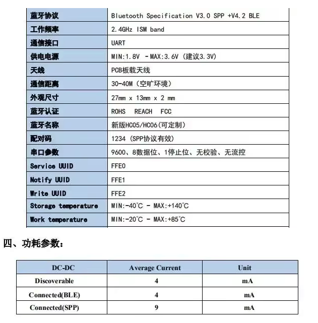
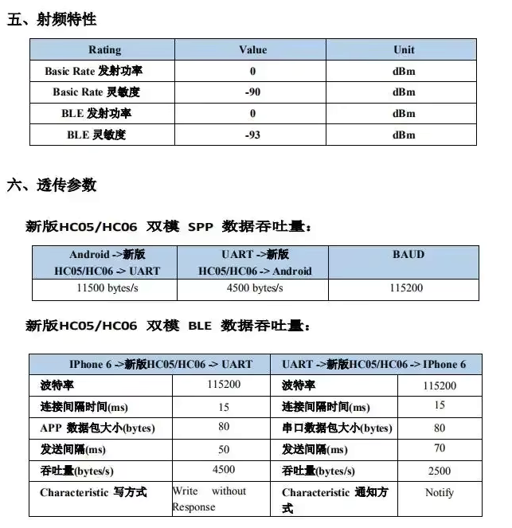
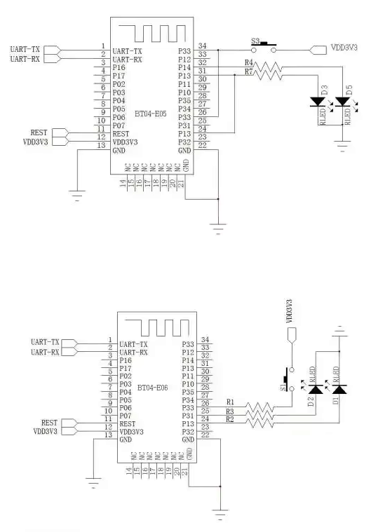
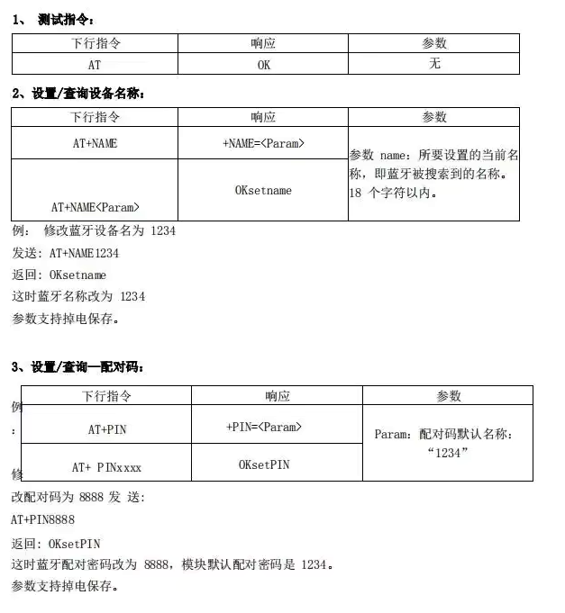
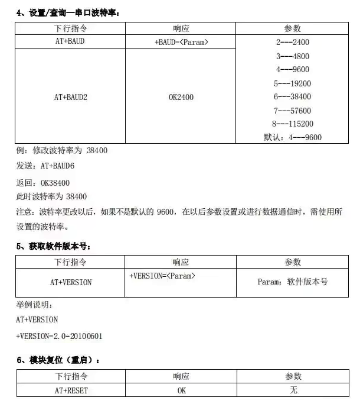
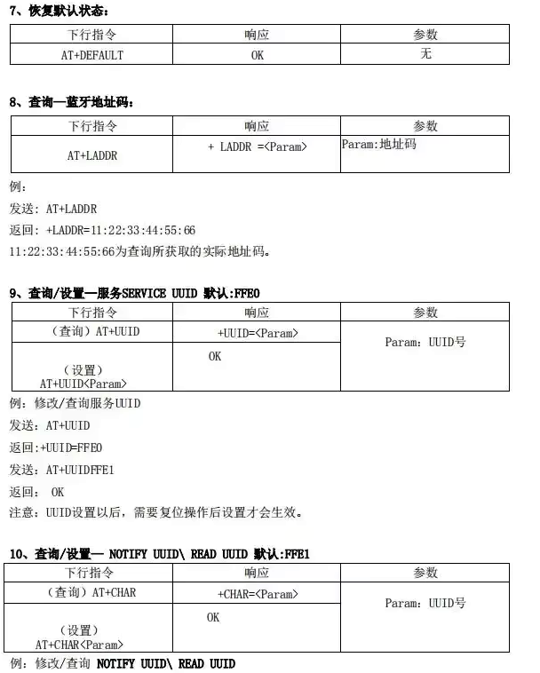
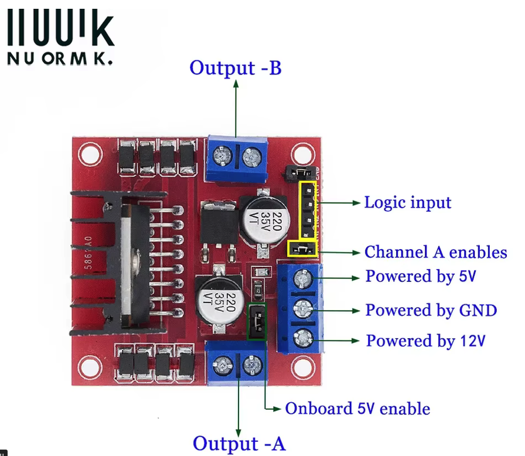
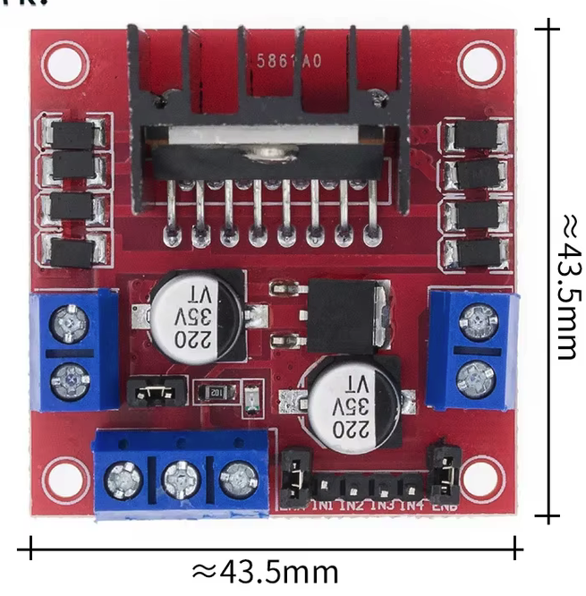
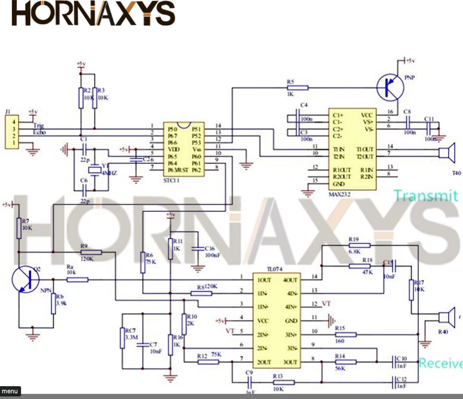
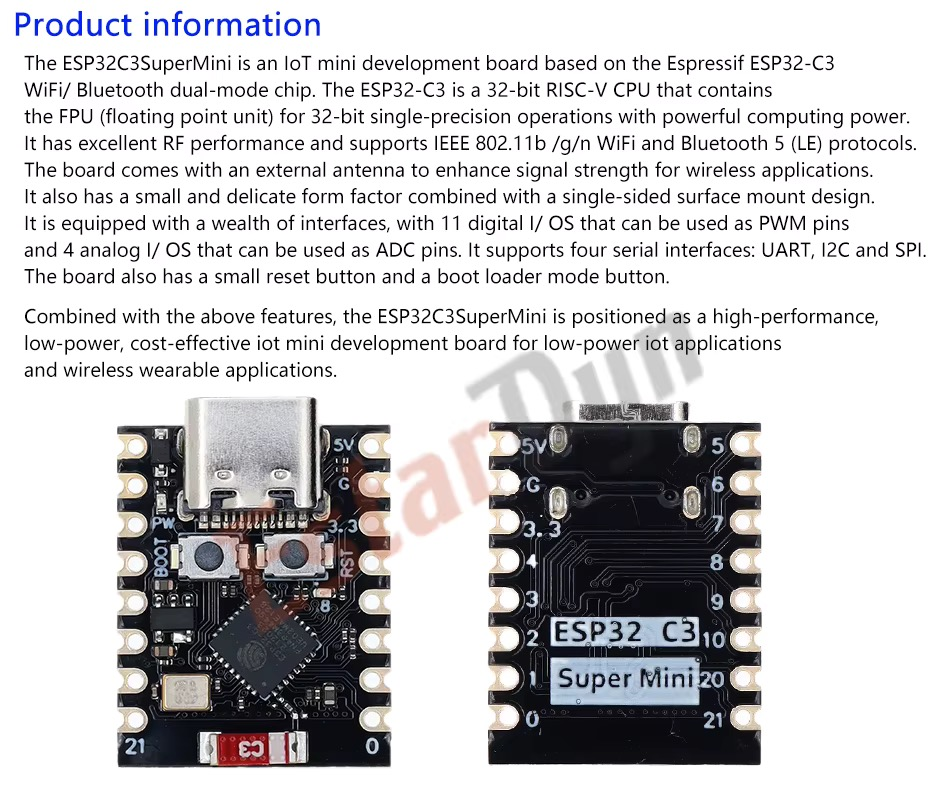

# MOTOR 

4 PCs DC Electric Motor DC 3-6V Dual Shaft Geared TT Magnetic Gearbox Engine with 65mm Plastic Car Tire Wheel Smart RC Car Robot

Dimension of the Tire: Outside Ф65mm/2.56"; Width 27mm/1.06'.
Maximum torque: 800k.cm. Also compatible with the motor whose reduction ratio is 1:120.
Great for RC car DIY or other electronic production.
Motor:
This is a TT DC Gearbox Motor with a gear ratio of 1:48.
Perfect for plugging into a breadboard or terminal blocks
Rated Voltage: 3 - 6V
Continuous No-Load Current: 150mA ‡ 10%
Min. Operating Speed (3V): 90 = 10% RPM
Min. Operating Speed (6V): 200 ÷ 10% RPM
Torque: 0.15Nm - 0.60Nm
Stall Torque (6V): 0.8kg.cm
Gear Ratio: 1:48
1
Material: Plastic
Body Dimensions: 70 × 22 × 18mm
Wires Length: 200mm 28 AWG
Product Weight: 29g / 1.02oz
Noise: <65dB
Wheel Parameter:
Center hole: 5.3MM × 3.66MM
Wheel diameter: 65mm
Wheel thickness: 28mm
Package Includes:
4 x DC Gear Motor
4 x Smart Car Robot Plastic Tire Wheel without wires

# Bluetooth

HC-05 HC-06 RF Wireless Bluetooth Transceiver Slave Module HC05 / HC06 RS232 / TTL to UART Converter and Adapter For Arduino

TXD: The sender, usually referred to as its own sender, must be connected to another device's RXD for normal communication.
RXD: The receiving end, usually represented as its own receiving end, must be connected to another device's TXD for normal communication.
During normal communication, the TXD itself is always connected to the RXD of the device!
Self receiving and spontaneous: During normal communication, the RXD is connected to the TXD of other devices. Therefore, if you want to receive data sent by yourself, as the name suggests, it means that your own TXD is directly connected to the RXD to test whether its transmission and reception are normal. This is a fast and simple testing method. When a problem occurs, the first step is to perform this test to determine whether the product is faulty. Also known as loop testing.
 
1.2 Level Logic:
TTL level: Usually, data representation is in binary format, with+5V equivalent to logic "1" and 0V equivalent to logic "0". This is called TTL signal system and is a positive logic system
RS232 level: using -12V to -3V, equivalent to logic "0",+3V to+12V logic level, equivalent to logic "1", is negative logic
 
1.3 Product Features:
1. The core module uses HC-05 as a slave module, with output interfaces including VCC, GND, TXD, RXD, KEY pin, and Bluetooth connection status output pin (STATE). The output is low when not connected and high when connected
2. LED indicates Bluetooth connection status, flash indicates no Bluetooth connection, slow flash indicates entering AT mode, double flash indicates Bluetooth is connected and the port is open
3. The base plate is equipped with anti reverse diodes, with a 3.3V LDO and an input voltage of 3.6-6V. The current is about 30mA when not paired and about 10mA when paired. The input voltage must not exceed 7V!
4. The interface level is 3.3V, which can be directly connected to various microcontrollers (51, AVR, PIC, ARM, MSP430, etc.), and 5V microcontrollers can also be directly connected without MAX232 and cannot pass through MAX232!
5. The effective distance of open space is 10 meters (power level is CLASS 2), and it is also possible to exceed 10 meters, but the connection quality at this distance is not guaranteed
6. After pairing, when using a full duplex serial port, there is no need to understand any Bluetooth protocol. It supports 8-bit data bits, 1-bit stop bits, and parity check communication formats, which are also commonly used communication formats and do not support other formats.
7. You can enter AT command mode by raising pin 34 to set parameters and query information
8. Compact size (3.57cm * 1.52cm), factory patch production ensures patch quality. Equipped with transparent heat shrink tubing, it is dust-proof and aesthetically pleasing, and has a certain anti-static ability.
9. Can switch to master or slave mode through AT command, and can connect to specified devices through AT command
10. Supports standard baud rates ranging from 4800bps to 1382400bps
 
1.4 Product Usage:
After pairing, it only needs to be used as a fixed baud rate serial port, so any serial port device with the communication format of "fixed baud rate, 8-bit data bits, no parity check" can directly replace the original wired serial port without modifying the program. Such as data collection, intelligent vehicles, serial printers, outdoor dot matrix strip screen control, etc.
Paired with a computer: Suitable for communication between a computer and a device via Bluetooth serial port, the usage method is the same as that of a serial port
Paired with mobile phone: suitable for communication between mobile phone and device through Bluetooth serial port, using the same method as serial port
Paired with Bluetooth host: Suitable for two devices to communicate directly through Bluetooth serial port, such as between microcontrollers, wired serial ports between microcontrollers, etc. The usage method is the same as the serial port
 
Flexible use:
Baud rate conversion, as the receiving and transmitting ends can choose their own baud rates, can be used as a device for baud rate conversion when the data volume is small.

# Driver Module TS1532S-L298N-Mo

Module Name: Dual H Bridge Motor Drive Module
Work Mode: H Bridge Drive (Double Road)
Main Control Chip: L298N
Packaging: Electrostatic Bag
Logical Voltage: 5V
Drive Voltage: 5V-35V
Logical Current: 0mA-36mA
Driving Current: 2A (MAX Single Bridge)
Storage Temperature: -20°C to +135°C
Maximum Power: 25W
Weight: 30g
Peripheral Dimensions: 43 x 43 x 27mm
Product Features:
Uses L298N as the main drive chip, providing strong driving capability, low heat generation, and strong anti-interference ability.
Built-in 78M05 drive power supply components can be used directly, but to avoid damage to the voltage regulator chip, please use an external 5V logic power supply when the driving voltage exceeds 12V.
Equipped with large capacity filter capacitors and a continuation protection diode to improve reliability.
Notes:
When the driving voltage is between 7V and 12V, the onboard 5V logic power supply can be used. When using the onboard 5V power supply, the +5V interface does not input voltage but can output 5V voltage for external use.
When the driving voltage is higher than 12V and less than or equal to 24V (although the chip manual suggests supporting 35V, it is recommended to conservatively apply a maximum voltage of 24V, for example, to drive a motor with a rated voltage of 18V). In this case, you must first remove the onboard 5V output enable jumper cap and then access the 5V power supply through the external 5V output port. The 5V enable power acts as a control signal with a level of 5V. When the signal input is valid and the motor drive module power supply is normal, the module outputs current. Otherwise, even if the power supply is normal, there will be no current output to the motor.

== important ==
The Power Block (Usually a 3-pin blue screw terminal)
12V (Power Input): This is where the positive red wire from your main battery pack goes. (Even if your battery is 7.4V or 9V, it goes here).
GND (Ground): The negative black wire from your battery goes here. Crucial rule: You MUST also run a wire from this GND terminal to a GND pin on your Arduino. If they don't share a common ground, the signals won't work.
5V (Power Output): The L298N has a built-in voltage regulator. It takes the big battery voltage and drops it down to a safe 5V. You can actually run a wire from this 5V terminal to the 5V or VIN pin on your Arduino to power the Arduino without needing a second battery!

# Ultrasonic sensor HCSR04

Model Number: Ultrasonic Ranging Module
Theory: Ultrasonic Sensor
Wide Voltage Operation: 3v-5.5v, Fully Compatible With Hc-Sro4 Software And Hardware Size
Detection Distance:
5v:2cm-450cm/0.78-175.5in
3.3v:2cm-400cm/0.78-156in
Detection Angle: <15
Adopt Industrial Grade Mcu, Working Temperature: -20℃-80℃.
Size: 45.00x20.00x15.00mm/1.77x0.79x0.59inch
1.HC-SRO4-P is a wide voltage ultrasonic distance measuring module.
2. The module form factor and software are fully compatible with the old version of HC-SRO4.
3. Seamless switching with the old version of HC-SRO4.
4. The low operating voltage as low as 3V enables it to be directly connected with 3.3V-powered MCL.

Note:
Due to the different monitor and light effect, the actual color of the item might be slightly different from the color showed on the pictures. Thank you!
Please allow 1-2cm measuring deviation due to manual measurement.

# ESP32-C3 supermini WIFI Bluetooth

                  